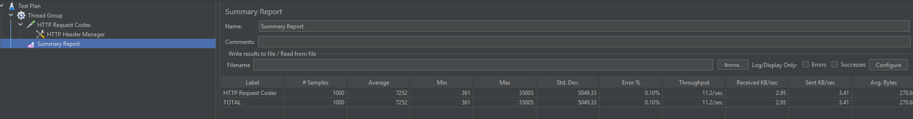

# Codex - Artifact Hunter API

Sistema de análisis de manuscritos antiguos para la los guardianes de la luz y su sabio lider Elowen, desarrollado como parte del desafío técnico "The Elowen Protocol".

## 🚀 Tecnologías
* **Framework:** Laravel 11 (PHP 8.2)
* **Base de Datos:** MySQL 8 (Azure Flexible Server)
* **Infraestructura:** Docker & Azure Container Registry
* **Despliegue:** Azure App Service (Linux)

## 🔗 URL de la API
`https://codex-app-duban-grhxbfa5c0h4a7f8.canadacentral-01.azurewebsites.net`

## 📡 Endpoints

### 1. Analizar Manuscrito
**POST** `/api/clue`
Busca secuencias de 4 letras idénticas (Horizontal, Vertical, Diagonal).

## 🚀 Tecnologías

### 200 OK: {"has_clue": true} (Pista encontrada)

### 403 Forbidden: {"has_clue": false} (Sin rastro)


## 📊 Evidencia de Pruebas de Carga (JMeter)
Para garantizar la escalabilidad requerida por Elowen, se sometió la API a una prueba de estrés en **Azure (Canadá Central)**.

**Resumen Ejecutivo:**
* **Usuarios Concurrentes:** 100
* **Peticiones Totales:** 1000
* **Tasa de Éxito:** 99.9% (Solo 1 fallo de 1000)
* **Throughput:** 11.2 peticiones/segundo
* **Tiempo Promedio:** ~7s (Debido al tier B1 "Burstable" de Azure) en pocas palabras el plan FREE :)

**Captura de Resultados:**



Desarrollado por Duban Andrey Hurtado Monsalve. 


**Body (JSON):**
```json
{
  "manuscript": [
    "RTHGQW",
    "XRLORE",
    "NARURR",
    "REVRAL",
    "EGSILE",
    "BRINDS"
  ]
}


